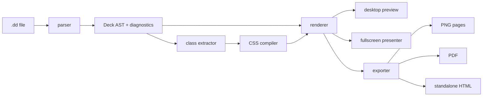

# Deckdown Architecture

Deckdown is an AI-first presentation system. The final product is not a markdown slide toy; it is a desktop-grade authoring, previewing, validating, and exporting application for `.dd` decks.

The product promise is:

> AI writes one `.dd` file. Deckdown makes it presentable, inspectable, editable, and exportable.

## Product Boundaries

Deckdown owns these responsibilities:

- Define the `.dd` file format.
- Parse and validate `.dd` documents.
- Compile Tailwind-style utility classes into deterministic CSS.
- Render 1920x1080 slide sections into a scaled preview surface.
- Provide a desktop viewer/editor with thumbnails, diagnostics, hot preview, fullscreen, and export.
- Export decks to PNG, PDF, and standalone HTML.
- Provide a CLI that can validate, preview, render, and export decks in automation.

Deckdown does not own these responsibilities:

- General-purpose design tooling.
- Collaborative editing.
- Cloud storage.
- A full Tailwind-compatible web framework.
- Arbitrary JavaScript execution inside slides.

## System Shape

The final repository should be a TypeScript-first monorepo with a Tauri desktop app and shared packages.

```text
Deckdown/
  apps/
    desktop/              Tauri desktop app
    web/                  React/Vite frontend bundled into the desktop client
  packages/
    parser/               .dd parser, AST, diagnostics
    compiler/             utility class extraction and CSS generation
    renderer/             slide mounting, scaling, navigation primitives
    exporter/             PNG/PDF/HTML export pipeline
    cli/                  deckdown command
    schema/               JSON schema and TypeScript model contracts
    examples/             canonical decks for tests and demos
  docs/
    ARCHITECTURE.md
    TECH_STACK.md
    FORMAT.md
    ROADMAP.md
```

The production implementation follows this structure. Experimental spikes should live outside the production package graph.

## Runtime Architecture



## Core Data Model

The parser returns one canonical structure. Every app surface consumes this structure rather than reparsing text differently.

```ts
export interface DeckDocument {
  version: "0.1";
  sourcePath?: string;
  frontmatter: DeckFrontmatter;
  slides: SlideDocument[];
  diagnostics: Diagnostic[];
}

export interface DeckFrontmatter {
  title: string;
  size: {
    width: number;
    height: number;
  };
  ratio: "16:9";
  engine: string;
}

export interface SlideDocument {
  id: string;
  order: number;
  html: string;
  sectionClass: string;
  notes?: string;
  sourceRange: SourceRange;
}

export interface Diagnostic {
  severity: "error" | "warning" | "info";
  code: string;
  message: string;
  range?: SourceRange;
}
```

## Parser Package

The parser is the format authority.

Responsibilities:

- Parse frontmatter.
- Parse `:::slide id` blocks.
- Enforce unique slide IDs.
- Enforce one root `<section>` per slide.
- Validate root section requirements.
- Produce source ranges for editor diagnostics.
- Keep malformed decks recoverable enough for preview when possible.

Implementation choices:

- Use `yaml` for frontmatter.
- Use a small custom block parser for `:::slide`.
- Use `parse5` for HTML structure validation.
- Use `zod` for typed frontmatter validation.

## Compiler Package

Deckdown should not run a full Tailwind build for every keystroke. It should use UnoCSS as the utility compiler because it is fast, embeddable, and designed for on-demand atomic CSS generation.

Responsibilities:

- Extract class tokens from slide HTML.
- Compile Tailwind-compatible utilities through UnoCSS.
- Support arbitrary values used by AI output, such as `w-[820px]` and `bg-[radial-gradient(...)]`.
- Return CSS plus unsupported-class diagnostics.
- Cache output by token set hash.

Important rule:

Deckdown compiles CSS for the deck, not for the whole app. The app UI CSS and deck CSS are isolated.

## Renderer Package

The renderer mounts one slide at a time into a fixed logical canvas.

Rules:

- Logical slide canvas is always the frontmatter size, initially `1920x1080`.
- The app scales the canvas to the available viewport with CSS transforms.
- Slide HTML is sanitized before mounting.
- Scripts, event handlers, remote stylesheets, remote scripts, and iframes are blocked.
- Deck CSS is injected into a slide-scoped stylesheet.

The renderer must work in:

- Tauri WebView.
- Desktop client frontend.
- Headless Chromium export page.

## Desktop App

The desktop app is the main product surface.

Primary views:

- Editor + live preview.
- Preview-only mode.
- Fullscreen presentation mode.
- Export dialog.
- Diagnostics panel.
- Thumbnail navigator.

Main workflows:

- Open `.dd`.
- Edit `.dd`.
- Save `.dd`.
- Validate `.dd`.
- Navigate slides.
- Present fullscreen.
- Export PNG.
- Export PDF.
- Export standalone HTML.

The desktop app should be implemented with Tauri so the product feels native while keeping the renderer identical to the web runtime.

## Exporter Package

Exports must be deterministic. The exporter renders the same AST and CSS as preview.

PNG export:

- Create a headless Chromium page.
- Set viewport to deck size.
- Render one slide per page.
- Screenshot each slide at exact pixel dimensions.
- Output `page-001.png`, `page-002.png`, etc.

PDF export:

- Render print-oriented document with one deck page per PDF page.
- Use Chromium PDF generation with exact page size.
- Preserve backgrounds.

HTML export:

- Emit a self-contained HTML file with deck metadata, slide HTML, compiled CSS, and navigation script.
- No network requirement.

## CLI

The CLI is a first-class interface for AI and automation.

Commands:

```bash
deckdown validate deck.dd
deckdown preview deck.dd
deckdown export deck.dd --png --out ./out
deckdown export deck.dd --pdf --out ./out/deck.pdf
deckdown export deck.dd --html --out ./out/deck.html
deckdown inspect deck.dd --json
```

The CLI and desktop app must share packages. The CLI must not duplicate parsing or rendering rules.

## Security Model

Deckdown files are documents, not applications.

Blocked in slide HTML:

- `<script>`
- Inline event handlers such as `onclick`
- `javascript:` URLs
- Remote scripts
- Remote stylesheets
- `<iframe>`
- `<object>`
- `<embed>`

Allowed:

- Semantic HTML.
- Inline SVG.
- Data URLs for images when size limits allow.
- Local packaged assets when explicitly referenced by a future asset manifest.

The first production renderer must use `DOMPurify` with an explicit allowlist.

## Testing Strategy

Unit tests:

- Frontmatter parsing.
- Slide block parsing.
- Source ranges.
- Invalid section detection.
- Class extraction.
- CSS compilation diagnostics.

Integration tests:

- CLI validate.
- CLI HTML export.
- Headless PNG export smoke test.
- PDF page count and size.

Visual tests:

- Render canonical example decks in Chromium.
- Compare screenshots with stable thresholds.
- Validate desktop and export render paths use the same compiled CSS.

## Versioning

Deckdown uses the `engine` field to choose behavior.

Initial engine:

```yaml
engine: deckdown@0.1
```

Breaking format changes require a new engine version. The parser should keep compatibility adapters where practical.
